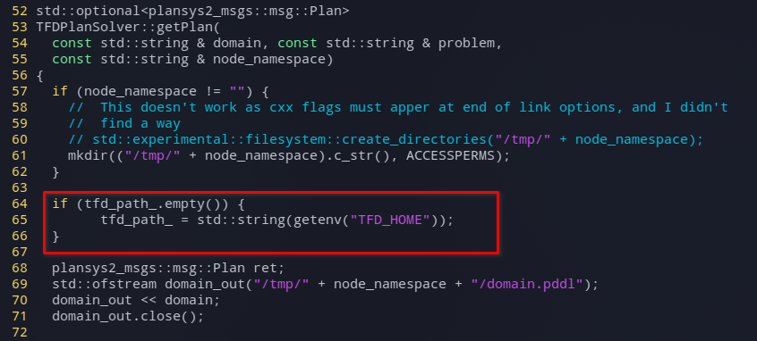

# PlanSys2

To run problem5 we used a Docker container with already compiled plansys2, available from the [Dockerfile-humble](./Dockerfile-humble) file. We used the tfd planner, so it has to be installed along with plansys2.

# Setup Docker

To setup the Docker container we used the following commands:
```shell
sudo docker build --rm  --tag ros-humble . --file Dockerfile-humble
```

```shell
sudo docker run -v /tmp/.X11-unix/:/tmp/.X11-unix/ -v {PATH_TO_REPO}/Automated-Planning-Project/problem5:/root/shared/problem5 --volume="$HOME/.Xauthority:/root/.Xauthority:rw" --network=host --name ubuntu_bash --env="DISPLAY" --rm -i -t ros-humble bash
```

Make sure to change `{PATH_TO_REPO}` with the absolute path where the repository is contained.

# Run the plan with TFD

## Setup TFD
Using the provided Docker file, TFD should be already installed. To enable it you need to modify the `plansys2_ws/src/ros2_planning_system/plansys2_bringup/params/plansys2_params.yaml` file:

```shell
vi plansys2_ws/src/ros2_planning_system/plansys2_bringup/params/plansys2_params.yaml
```

and change the `plan_solver_plugins` parameter to `"TFD"`.

Then run the two following commands:
```shell
source /opt/ros/humble/setup.bash
source plansys2_ws/install/setup.bash
```

### Warning!
In our case it happened that the TFD planner was not properly configured when plansys2 was loaded. In particular, 
even if the `TFD_HOME` environmental variable was set in the `~/.bashrc` file and plansys said that the planner was configured:


the `tfd_path_` private variable of the `TFDPlanSolver` class was empty when the `getPlan` method was called. This resulted in an error because plansys was not able to call the `translate/translate.py` script of tfd since it didn't have the correct path. 

To solve this issue we modified `tfd_plan_solver.cpp` by adding a simple `if` condition to check if `tfd_path_` was set. If it wasn't set we set it to `TFD_HOME`.

This is the condition to add on line `64` of `plansys2_ws/src/ros2_planning_system/plansys2_tfd_plan_solver/src/plansys2_tfd_plan_solver/tfd_plan_solver.cpp`:
```cpp
if (tfd_path_.empty()) {
      tfd_path_ = std::string(getenv("TFD_HOME"));
}  
```

To access the file you can run:
```shell
vi ~/plansys2_ws/src/ros2_planning_system/plansys2_tfd_plan_solver/src/plansys2_tfd_plan_solver/tfd_plan_solver.cpp
```

This is a screenshot of the code to have a better understanding of where to insert the code:



After adding the code and saving the file run this command to recompile plansys:
```shell
cd ~/plansys2_ws && source /opt/ros/${ROS_DISTRO}/setup.bash && colcon build --symlink-install
```

## Run the plan
To run the plan, first move into the problem directory:

```shell
cd ~/shared/problem5/problem5tfd/
```

then run

```shell
colcon build --symlink-install
rosdep install --from-paths . --ignore-src -r -y
colcon build --symlink-install
```

Now, you need to run 
```shell
source /opt/ros/humble/setup.bash
source ./install/setup.bash
```

Now you can launch the server with
```
ros2 launch problem5tfd launcher.py &
```

Then launch the plansys2 terminal:
```
ros2 run plansys2_terminal plansys2_terminal
```
and load the problem file
```
source /root/shared/problem5/problem5tfd/launch/commands
```

Finally you can get the plan with:
```shell
get plan
```

or run a simulation with:
```shell
run
```

# Run the plan with POPF

In this case you don't need to setup anything since POPF is the default planner in plansys, however POPF does not support negative-preconditions.

To run the plan, first run the two following commands:
run the two following commands:
```shell
source /opt/ros/humble/setup.bash
source plansys2_ws/install/setup.bash
```

Then move into the problem directory:
```shell
cd ~/shared/problem5/problem5popf/
```

then run

```shell
colcon build --symlink-install
rosdep install --from-paths . --ignore-src -r -y
colcon build --symlink-install
```

Now, inside the `problem5` folder you need to run again 
```shell
source /opt/ros/humble/setup.bash
source ./install/setup.bash
```

Now you can launch the server with
```
ros2 launch problem5popf launcher.py &
```

Then launch the plansys2 terminal:
```
ros2 run plansys2_terminal plansys2_terminal
```
and load the problem file
```
source /root/shared/problem5/problem5popf/launch/commands
```

Then you can run
```shell
get plan
```
However, at least in our case, this will result in `Plan not found` since popf is too slow and it will be stopped before finding the plan.

To solve this issue you can quit from the plansys terminal with
```shell
quit
```
and run 
```shell
ros2 run popf popf /tmp/domain.pddl /tmp/problem.pddl
```
to get a plan.